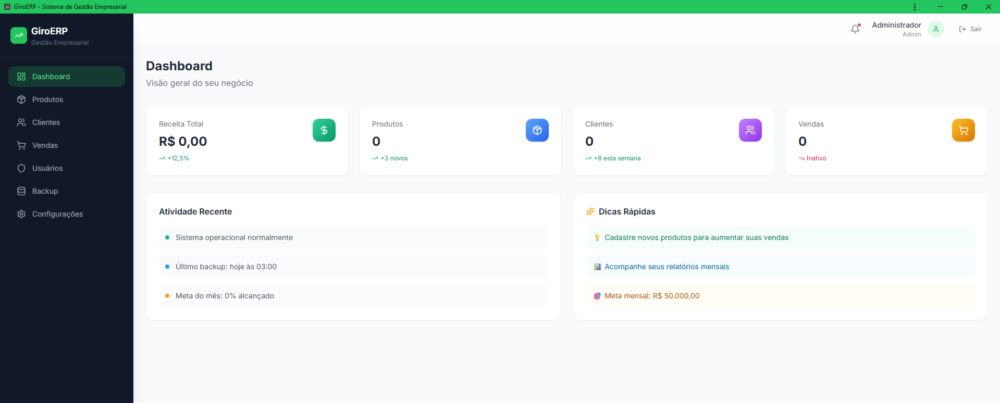
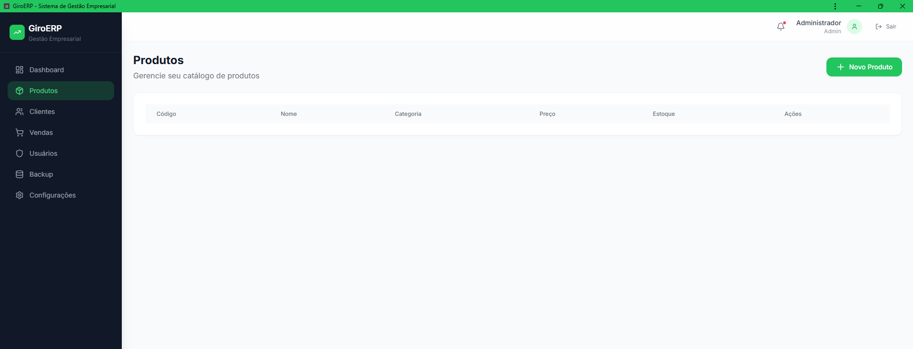
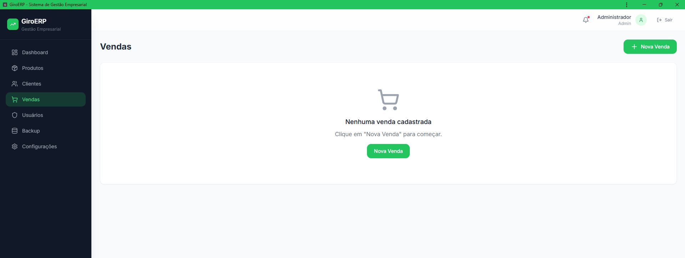

# 🚀 GiroERP

### Sistema de Gestão Empresarial Moderno

Plataforma ERP desenvolvida para pequenas e médias empresas, oferecendo controle completo de vendas, clientes, produtos, usuários e operações em uma interface moderna, responsiva e instalável como aplicativo.

<p align="center">


</p>

---

## ✨ Principais Recursos

* 📊 Dashboard com indicadores em tempo real
* 📦 Gestão completa de produtos e estoque
* 👥 Cadastro e gerenciamento de clientes
* 💰 Controle de vendas e pagamentos
* 🔐 Autenticação JWT e controle de permissões
* 👨‍💼 Gestão de usuários e perfis de acesso
* 💾 Sistema de backup automático
* 📱 Progressive Web App (PWA)

---

## 🏗️ Arquitetura

```text
Frontend (React + TypeScript)
        │
        ▼
 REST API (Spring Boot)
        │
        ▼
 Banco de Dados
```

### Backend

* Java 21
* Spring Boot 3
* Spring Security
* JWT Authentication
* Spring Data JPA
* Maven

### Frontend

* React 18
* TypeScript
* Tailwind CSS
* Vite
* Axios
* React Router

---

## 🚀 Executando o Projeto

### Backend

```bash
cd backend
mvn clean package -DskipTests
java -jar target/giroerp-1.0.0.jar
```

Servidor:

```text
http://localhost:8080
```

### Frontend

```bash
cd frontend
npm install
npm run dev
```

Aplicação:

```text
http://localhost:3000
```

---

## 🔒 Segurança

* JWT Authentication
* BCrypt Password Encoder
* Controle de acesso por perfil
* Proteção de rotas
* Configuração segura de CORS

---

## 📱 PWA

O GiroERP pode ser instalado em:

* Android
* iOS
* Windows
* Linux
* macOS

Funcionando inclusive com suporte offline.

---

## 📸 Screenshots

### Dashboard



### Gestão de Produtos



### Gestão de Vendas



---

## 🎯 Objetivo

O GiroERP foi criado para demonstrar boas práticas de desenvolvimento Full Stack utilizando Java, Spring Boot, React e TypeScript, aplicando conceitos de arquitetura moderna, autenticação segura e experiência de usuário otimizada.

---

## 👨‍💻 Desenvolvedor

**Adan William**

Analista de TI | Desenvolvedor Full Stack

💼 Especializado em:

* Java & Spring Boot
* React & TypeScript
* Infraestrutura e Redes
* DevOps & Docker

---

⭐ Se este projeto foi útil, deixe uma estrela no repositório.
